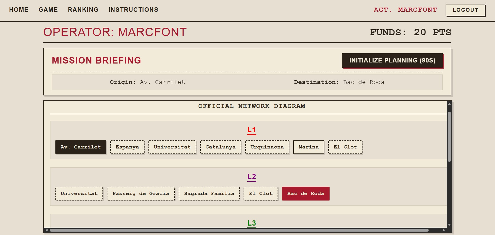
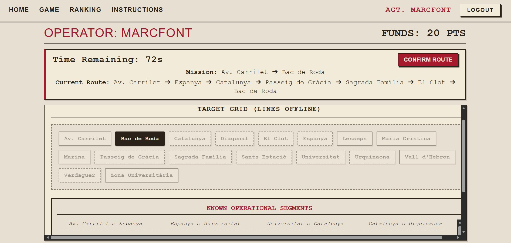
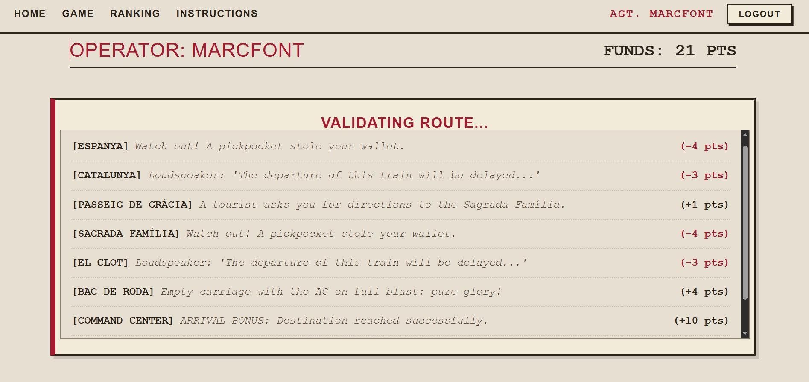
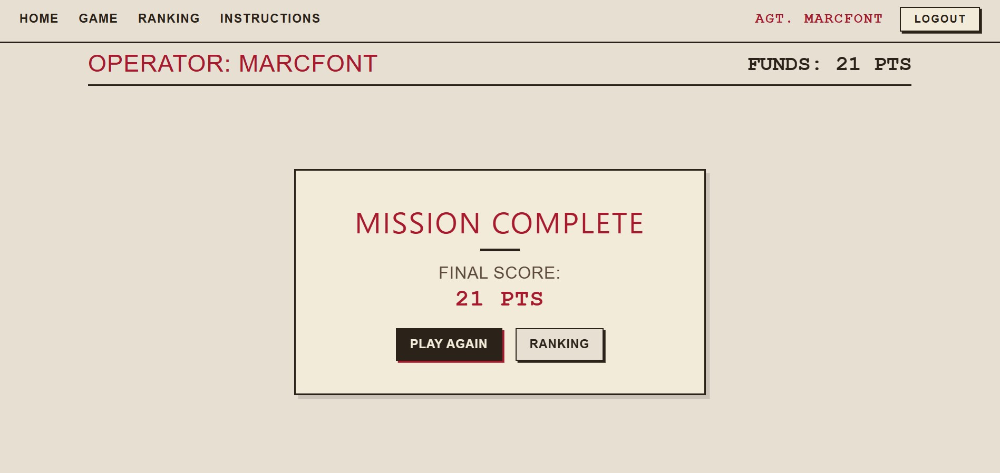
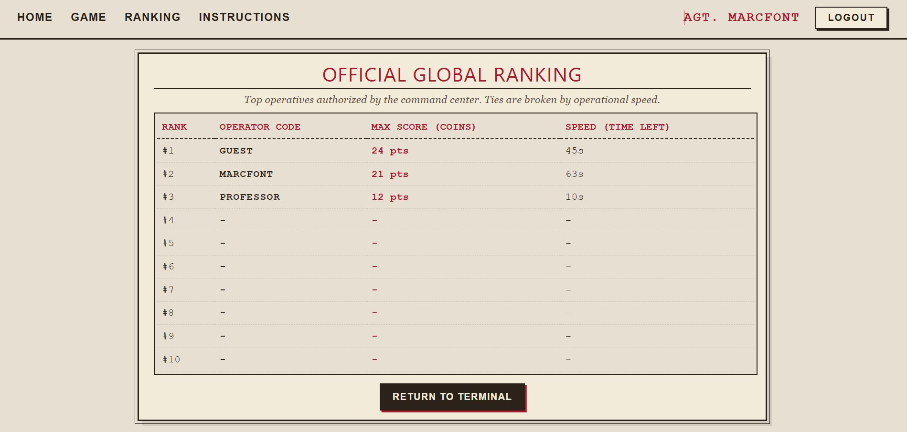

# Exam #1: "Last Race"

**Student:** 363159 FONT RUANA MARC  

## Description
"Last Race" is a web-based simulation and strategy game where players act as transit operators. The goal is to plan and execute a valid route through a subway network within a time limit, dealing with random operational events that affect the final score. Built with React (Frontend) and Node.js/Express + SQLite (Backend).

## React Client Application Routes

- Route `/`: `HomePage`. Public view with instructions and login link.
- Route `/login`: `LoginForm`. User authentication handled via Passport.js.
- Route `/game`: `GameContainer`. Core game loop, including the network map, timer, and gameplay logic.
- Route `/ranking`: `RankingPage`. Displays the official global ranking with the best scores of all registered users.
- Route `/instructions`: `InstructionsPage`. Detailed guide on how to play "Last Race".

## API Server

### Authentication
- `POST /api/sessions`
  - Request body: JSON object with `username` and `password`.
  - Response body: Authenticated user object (`id`, `username`).
- `GET /api/sessions/current`
  - Response body: Currently logged-in user object.
- `DELETE /api/sessions/current`
  - Response body: Logout confirmation message.

### Game Logic & Network
- `GET /api/network`
  - Response body: JSON object containing `lines` (grouped with their `stations`) and `connections`.
- `GET /api/game/setup`
  - Response body: JSON object with `start` and `end` station objects (guaranteed minimum distance of 3 stops).
- `POST /api/games/1/route`
  - Request body: JSON object with `route` (array of visited stations) and `endId`.
  - Response body: JSON object containing validation status (`isValid`), total calculated `coins`, and the detailed `eventsLog`.
- `POST /api/games`
  - Request body: JSON object with `startStationId`, `endStationId`, `score`, and `timeLeft`.
  - Response body: Confirmation message (saves the match to the database).
- `GET /api/ranking`
  - Response body: JSON array with the top 10 historical scores, resolving ties by operational speed (`time_left`).

## Database Tables

- Table `Users`: Stores credentials (username and hashed/salted passwords).
- Table `Stations`: Contains station metadata (id, name, isInterchange status).
- Table `Lines`: Stores metro lines (name and color).
- Table `Connections`: Graph segments connecting stations, associated with a `line_id`.
- Table `Events`: Descriptions and point modifiers (+/- coins) for random transit events.
- Table `Games`: History of games played, tracking the user, origin/destination, score, time left, and timestamp.

## Main React Components

- `GameContainer` (in `GameContainer.jsx`): Orchestrates the entire game lifecycle (Setup, Planning, Execution, Result), timer logic, and state management.
- `NetworkMap` (in `NetworkMap.jsx`): Visual interface that renders the subway network. It adapts dynamically to show either the scrambled target grid or the official line diagram depending on the game phase, while preventing invalid moves.
- `RankingPage` (in `RankingPage.jsx`): Fetches and displays the top 10 operators in a responsive data table.

## Screenshot

### In-Game Execution

### Global Ranking

## Users Credentials

- **Username:** marcfont | **Password:** password123
- **Username:** professor | **Password:** password123
- **Username:** guest | **Password:** password123

## Use of AI Tools
AI tools (specifically a Large Language Model assistant) were utilized during the development of this project to accelerate debugging, optimize queries, and refine UI layouts. Key use cases included:
1. **React State Management:** Troubleshooting `useEffect` lifecycle issues to prevent double-counting bugs during the point calculation animation (Strict Mode adaptations).
2. **Database Optimization:** Refining complex SQLite queries for the Ranking system to ensure it correctly fetched the absolute maximum score per user while properly resolving ties.
3. **UI/UX Styling:** Generating advanced CSS Flexbox structures to create a responsive, single-page application feel without vertical scrolling, and ensuring text overflow handling in the event logs.

All AI-generated snippets were thoroughly reviewed, tested against edge cases (such as route backtracking exploits), and manually adapted to strictly meet the architectural requirements of the exam.